# Entity Relationship Diagram

## Purpose

This file is the **canonical visual reference** for the backend database schema
of the `learnify.edu` FastAPI service. It is generated **manually from the
SQLAlchemy ORM table definitions** and kept in sync with:

- Alembic migration scripts — located under
  [`app/migrations/versions/`](../migrations/versions)
- SQLAlchemy ORM models — located per-module under
  [`app/modules/*/table.py`](../modules)
- The common [`BaseTable`](../core/table.py#L9-L26)
  abstract base that every concrete table inherits from (see below)

> Whenever a table definition is modified, a migration added, or a
> relationship changes, **update this file at the same time** as part of the
> same commit (schema + docs = atomic change).

---

## How to view / render

The diagram is a standard [Mermaid](https://mermaid.js.org/) `erDiagram` block.
Supported renderers:

| Renderer | Notes |
|---|---|
| **GitHub / GitLab** | Native — view the `.md` file in the browser |
| **VS Code** | Install the `bierner.markdown-mermaid` extension, then **Open Preview** on this file |
| **IntelliJ / PyCharm** | Built-in Mermaid rendering in Markdown preview pane |
| **CLI (svg / png)** | `npx -y @mermaid-js/mermaid-cli -i README.md -o erd.svg` |
| **Live editor** | Copy/paste the fenced `erDiagram` block into https://mermaid.live |

---

## Diagram conventions (Mermaid erDiagram grammar)

| Symbol in diagram | Meaning |
|---|---|
| `PK` | Primary key (one per table; all tables inherit from `BaseTable.id`) |
| `FK` | Foreign key — points to a column in another table |
| `UK` | Unique key / unique constraint |
| *(no IX)* | Mermaid erDiagram has **no** grammar token for indexes. Indexes defined in `__table_args__` in the ORM are omitted; consult the source tables below for exact `Index()` declarations and their columns. |
| `"quoted comment"` after a column | Human-readable annotation — default values, cascade behavior, enum role, etc. Not rendered in all viewers but preserved in the source. |

### Cardinality legend for relationships

```
||--||   exactly one to exactly one      (used for joined-table inheritance FK)
||--o|   exactly one to zero or one     (self-referential reports_to, verified_by, etc.)
||--o{   exactly one to zero or more    (owner → collection with delete-orphan cascade)
||--|{   exactly one to one or more     (attempt → enrollees via FK)
```

---

## Table inventory (22 concrete tables + 1 abstract base)

All 22 concrete tables inherit from `BaseTable`, which contributes four
audit columns automatically. See
[`app/core/table.py`](../core/table.py#L1-L26)
for the base implementation.

| # | Domain | Table name | Source file | PK | Unique keys | Indexes (see `__table_args__`) |
|---|---|---|---|---|---|---|
| 0 | **Base (abstract)** | `BaseTable` | [`core/table.py`](../core/table.py#L9-L26) | `id` | *(none)* | *(none)* |
| **User domain** |
| 1 | Users | `users` | [`user/table.py`](../modules/user/table.py#L18-L47) | `id` | `uuid`, `email` | `id` (default) |
| 2 | Users | `contact_persons` | [`user/table.py`](../modules/user/table.py#L50-L73) | `user_id (PK,FK)` | `email` | *(none)* |
| 3 | Users / Auth | `tokens` | [`authentication/table.py`](../modules/authentication/table.py#L17-L45) | `id` | `token` | `token` |
| **Employee domain (extends users via JTI)** |
| 4 | Employees | `employees` | [`employee/table.py`](../modules/employee/table.py#L42-L153) | `id (PK,FK→users)` | `employee_id` | *(none in table_args; use_alter FK defined)* |
| 5 | Employees | `employee_compensation_history` | [`employee/table.py`](../modules/employee/table.py#L156-L191) | `id` | `(employee_id, effective_date)` | `employee_id`, `effective_date` |
| 6 | Employees | `employee_leave_credits` | [`employee/table.py`](../modules/employee/table.py#L194-L223) | `id` | `(employee_id, leave_type, fiscal_year)` | `employee_id` |
| 7 | Employees | `employee_documents` | [`employee/table.py`](../modules/employee/table.py#L226-L275) | `id` | *(none)* | `employee_id`, `verified_by_id`, `expiry_date` |
| 8 | Employees | `employee_performance_reviews` | [`employee/table.py`](../modules/employee/table.py#L278-L328) | `id` | *(none)* | `employee_id`, `reviewer_id`, `review_date` |
| 9 | Employees | `employee_education_history` | [`employee/table.py`](../modules/employee/table.py#L331-L376) | `id` | *(none)* | `employee_id`, `year_completed`, `diploma_document_id` |
| 10 | Employees | `employee_bank_accounts` | [`employee/table.py`](../modules/employee/table.py#L379-L410) | `id` | *(none)* | `employee_id`, `is_primary` |
| **Enrollee domain (extends users via JTI)** |
| 11 | Enrollees | `enrollees` | [`enrollee/table.py`](../modules/enrollee/table.py#L27-L107) | `id (PK,FK→users)` | `application_reference_number`, `exam_link_uuid`, `interview_link_uuid` | *(none)* |
| **Student domain (extends users via JTI)** |
| 12 | Students | `students` | [`student/table.py`](../modules/student/table.py#L9-L23) | `id (PK,FK→users)` | `student_id` | *(none)* |
| **Exam domain** |
| 13 | Exam | `exams` | [`exam/table.py`](../modules/exam/table.py#L28-L61) | `id` | `uuid` | *(none)* |
| 14 | Exam | `exam_questions` | [`exam/table.py`](../modules/exam/table.py#L64-L89) | `id` | *(none)* | *(none)* |
| 15 | Exam | `exam_options` | [`exam/table.py`](../modules/exam/table.py#L92-L105) | `id` | *(none)* | *(none)* |
| 16 | Exam | `exam_attempts` | [`exam/table.py`](../modules/exam/table.py#L108-L139) | `id` | `uuid` | *(none)* |
| 17 | Exam | `exam_answers` | [`exam/table.py`](../modules/exam/table.py#L142-L169) | `id` | *(none)* | *(none)* |
| **Interview domain** |
| 18 | Interview | `interview_templates` | [`interview/table.py`](../modules/interview/table.py#L28-L61) | `id` | `uuid` | *(none)* |
| 19 | Interview | `interview_questions` | [`interview/table.py`](../modules/interview/table.py#L64-L92) | `id` | *(none)* | *(none)* |
| 20 | Interview | `interview_options` | [`interview/table.py`](../modules/interview/table.py#L95-L108) | `id` | *(none)* | *(none)* |
| 21 | Interview | `interview_sessions` | [`interview/table.py`](../modules/interview/table.py#L111-L152) | `id` | `uuid` | *(none)* |
| 22 | Interview | `interview_answers` | [`interview/table.py`](../modules/interview/table.py#L155-L184) | `id` | *(none)* | *(none)* |

---

## Inheritance model (Joined-Table Inheritance via SQLAlchemy)

The three user roles are modeled with **SQLAlchemy Joined-Table Inheritance
(JTI)**. `users` is the parent polymorphic table; `employees`, `enrollees`, and
`students` are child tables that share `users.id` as their primary key **and**
foreign key back to the parent.

```
users (user_type discriminator: ENROLLEE | STUDENT | EMPLOYEE)
 ├─ employees  (polymorphic_identity = "EMPLOYEE")
 ├─ enrollees  (polymorphic_identity = "ENROLLEE")
 └─ students   (polymorphic_identity = "STUDENT")
```

Because of this design, **every** user row in `employees` / `enrollees` /
`students` has a **mandatory matching row** in `users`, and deleting a user
cascades to all three child tables (plus `tokens` and `contact_persons`).

### Enrollee promotion flow (cross-table)

```
enrollees.promoted_to_student_id  ──FK──▶  students.id
        (1:0|1, SET NULL on delete)
```

When an enrollee is admitted, their row is **not** moved; instead a linked
`students` row is created and `promoted_to_student_id` + `promoted_at` are
set on the enrollee. This preserves the admissions audit trail.

### Employee self-references

Employees form two graphs via self-FKs that the diagram renders as
`employees → employees`:

| Field | Meaning |
|---|---|
| `employees.reports_to_id` → `employees.id` | Organizational reporting hierarchy (manager / IC) |

And two additional cross-FKs from other employee-domain tables back to employees:

| Field | Meaning |
|---|---|
| `employee_documents.verified_by_id` → `employees.id` | HR / admin who verified the document upload |
| `employee_performance_reviews.reviewer_id` → `employees.id` | Reviewer (often manager) for the performance cycle |

---

## Enum types

Every column whose ORM type is `mapped_column(Enum(SomeEnum))` is typed in the
diagram using the Enum class name directly (e.g. `UserTypeEnum user_type`).
All Enum definitions live in their module's `validation.py` Pydantic schemas
file — click through for the exact allowed values:

| Enum class | Defined in |
|---|---|
| `UserTypeEnum`, `ContactRelationEnum`, `PreferredContactEnum` | [`user/validation.py`](../modules/user/validation.py#L9-L40) |
| `GenderEnum` (Pydantic-only — ORM column is plain `string`) | [`user/validation.py`](../modules/user/validation.py#L15-L18) |
| `TokenTypeEnum` | [`authentication/validation.py`](../modules/authentication/validation.py#L10-L15) |
| `DepartmentEnum` … `PerformanceRatingEnum` (11 enums) | [`employee/validation.py`](../modules/employee/validation.py#L16-L137) |
| `EnrolleeApplicationStatusEnum`, `SemesterEnum`, `LatestExamStatusEnum`, `LatestInterviewStatusEnum`, `InterviewFormatEnum`, `CoursesEnum` | [`enrollee/validation.py`](../modules/enrollee/validation.py#L10-L156) |
| `StudentAcademicStatusEnum` | [`student/validation.py`](../modules/student/validation.py#L14-L20) |
| `ExamStatusEnum`, `ExamAttemptStatusEnum`, `QuestionTypeEnum` | [`exam/validation.py`](../modules/exam/validation.py#L10-L27) |
| `InterviewStatusEnum`, `InterviewSessionStatusEnum`, `InterviewQuestionTypeEnum` | [`interview/validation.py`](../modules/interview/validation.py#L10-L28) |

---

## How to regenerate / update when schema changes

1. Modify the relevant `table.py` in the appropriate module under
   `app/modules/<domain>/table.py`.
2. Create the Alembic migration: `make -C backend/fastapi migrate message="..."`
   (or `cd backend/fastapi && alembic revision --autogenerate -m "..."`, then
   `alembic upgrade head`).
3. Apply both migrations and the ORM change.
4. **Update this file**:
   - Add / remove / edit the corresponding row(s) in the Mermaid `erDiagram` block.
   - Keep multi-key fields **comma-separated**: `PK,FK` not `PK FK`.
   - Do **not** add `IX` tokens (invalid in Mermaid grammar); update the
     inventory table above for indexes.
   - If the change affects the inventory, inheritance model, or enum types,
     update the matching section above.
5. Re-validate the diagram in your IDE's Mermaid preview or via
   `mermaid.parse()` before committing.

---

## Diagram

```mermaid
erDiagram
    BaseTable {
        integer id PK "PK auto"
        datetime created_at "server_default now()"
        datetime updated_at "onupdate now()"
        datetime deleted_at "nullable"
    }

    users {
        integer id PK
        string uuid UK
        string email UK
        string password
        string first_name
        string last_name
        string phone_number
        string alternate_phone_number
        string gender
        date date_of_birth
        string address
        boolean is_verified "default false"
        UserTypeEnum user_type "discriminator"
    }

    contact_persons {
        integer user_id PK,FK "FK -> users.id CASCADE"
        string first_name
        string last_name
        string email UK
        string phone_number
        string alternate_phone_number
        string address
        string occupation
        ContactRelationEnum relation_to_user
        boolean is_primary_contact
        boolean is_emergency_contact
        PreferredContactEnum preferred_contact_method
    }

    tokens {
        integer id PK
        integer user_id FK "-> users.id CASCADE"
        string token UK
        TokenTypeEnum token_type
        datetime expires_at
        boolean is_revoked
        string family_id
    }

    employees {
        integer id PK,FK "FK -> users.id"
        string employee_id UK
        DepartmentEnum department
        EmployeeRoleEnum role
        date date_hired
        EmploymentTypeEnum employment_type
        EmployeeStatusEnum employee_status
        date probation_end_date
        date date_regularized
        date date_separated
        string separation_reason
        WorkArrangementEnum work_arrangement
        string job_title
        integer reports_to_id FK "-> employees.id SET NULL"
        string office_location
        string extension_number
        string work_email
        integer teaching_load_units
        string advisory_class_section
        HighestEducationEnum highest_education
        string alma_mater
        integer year_graduated
        string field_of_study
        string professional_license_number
        date license_expiry
        integer years_of_prior_experience
        boolean nda_signed
        BackgroundCheckStatusEnum background_check_status
        date last_background_check_date
        decimal basic_salary
        string salary_grade
        PayFrequencyEnum pay_frequency
        string currency "PHP"
        date last_performance_review_date
        date next_performance_review_date
        string latest_performance_rating
    }

    employee_compensation_history {
        integer id PK
        integer employee_id FK "-> employees.id CASCADE"
        date effective_date
        date end_date
        decimal basic_salary
        string salary_grade
        PayFrequencyEnum pay_frequency
        string currency
        CompensationChangeReasonEnum change_reason
        string notes
    }

    employee_leave_credits {
        integer id PK
        integer employee_id FK "-> employees.id CASCADE"
        LeaveTypeEnum leave_type
        string fiscal_year
        decimal total_credited
        decimal used
        decimal balance
        date as_of_date
        string notes
    }

    employee_documents {
        integer id PK
        integer employee_id FK "-> employees.id CASCADE"
        EmployeeDocumentTypeEnum document_type
        string document_title
        string file_name
        string file_path
        string file_url
        string mime_type
        datetime uploaded_at
        date expiry_date
        integer verified_by_id FK "-> employees.id SET NULL"
        string notes
    }

    employee_performance_reviews {
        integer id PK
        integer employee_id FK "-> employees.id CASCADE"
        date review_date
        string review_period
        integer reviewer_id FK "-> employees.id SET NULL"
        PerformanceRatingEnum rating
        integer score_numeric
        text overall_comments
        text goals_next_period
        date employee_sign_off_date
        date reviewer_sign_off_date
        date next_review_date
        string attachments_path
    }

    employee_education_history {
        integer id PK
        integer employee_id FK "-> employees.id CASCADE"
        HighestEducationEnum degree
        string field_of_study
        string institution_name
        string institution_location
        integer year_started
        integer year_completed
        boolean is_incomplete
        string honors
        string thesis_title
        integer diploma_document_id FK "-> employee_documents.id SET NULL"
    }

    employee_bank_accounts {
        integer id PK
        integer employee_id FK "-> employees.id CASCADE"
        string bank_name
        string bank_branch
        string routing_code
        string account_number
        BankAccountTypeEnum account_type
        string account_holder_name
        string currency
        boolean is_primary
        boolean is_active
        date verified_at
        string notes
    }

    enrollees {
        integer id PK,FK "FK -> users.id"
        EnrolleeApplicationStatusEnum application_status
        EnrolleeApplicationStatusEnum previous_application_status
        string chosen_course
        string previous_school
        string application_reference_number UK
        string academic_year
        SemesterEnum semester
        string strand_or_track
        integer previous_school_graduated_year
        float general_weighted_average
        string exam_link_uuid UK
        datetime exam_link_expires_at
        LatestExamStatusEnum latest_exam_status
        float exam_score
        float exam_pass_score
        boolean interview_required
        InterviewFormatEnum interview_format
        datetime interview_scheduled_at
        integer interviewed_by FK "-> employees.id SET NULL"
        datetime interviewed_at
        string interview_link_uuid UK
        datetime interview_link_expires_at
        LatestInterviewStatusEnum latest_interview_status
        float interview_score
        float interview_pass_score
        integer approved_by FK "-> employees.id SET NULL"
        datetime approved_at
        integer promoted_to_student_id FK "-> students.id SET NULL"
        datetime promoted_at
    }

    students {
        integer id PK,FK "FK -> users.id"
        string student_id UK
        integer year_level
        StudentAcademicStatusEnum academic_status
    }

    exams {
        integer id PK
        string uuid UK
        string title
        text description
        string course_code
        integer duration_minutes
        float pass_score
        ExamStatusEnum status
        integer created_by FK "-> employees.id SET NULL"
    }

    exam_questions {
        integer id PK
        integer exam_id FK "-> exams.id CASCADE"
        text question_text
        QuestionTypeEnum question_type
        integer points
        integer order_index
    }

    exam_options {
        integer id PK
        integer question_id FK "-> exam_questions.id CASCADE"
        string option_text
        boolean is_correct
    }

    exam_attempts {
        integer id PK
        string uuid UK
        integer enrollee_id FK "-> enrollees.id CASCADE"
        integer exam_id FK "-> exams.id CASCADE"
        ExamAttemptStatusEnum status
        float pass_score_snapshot
        datetime started_at
        datetime submitted_at
        float score
        integer time_spent_seconds
    }

    exam_answers {
        integer id PK
        integer attempt_id FK "-> exam_attempts.id CASCADE"
        integer question_id FK "-> exam_questions.id CASCADE"
        integer selected_option_id FK "-> exam_options.id SET NULL"
        text text_answer
        boolean is_correct
        float points_awarded
    }

    interview_templates {
        integer id PK
        string uuid UK
        string title
        text description
        string course_code
        integer duration_minutes
        float pass_score
        InterviewStatusEnum status
        integer created_by FK "-> employees.id SET NULL"
    }

    interview_questions {
        integer id PK
        integer interview_id FK "-> interview_templates.id CASCADE"
        text question_text
        InterviewQuestionTypeEnum question_type
        integer points
        integer order_index
    }

    interview_options {
        integer id PK
        integer question_id FK "-> interview_questions.id CASCADE"
        string option_text
        boolean is_correct
    }

    interview_sessions {
        integer id PK
        string uuid UK
        integer enrollee_id FK "-> enrollees.id CASCADE"
        integer interview_id FK "-> interview_templates.id CASCADE"
        InterviewSessionStatusEnum status
        float pass_score_snapshot
        datetime scheduled_at
        datetime started_at
        datetime completed_at
        float score
        integer time_spent_seconds
        integer conducted_by FK "-> employees.id SET NULL"
        text notes
    }

    interview_answers {
        integer id PK
        integer session_id FK "-> interview_sessions.id CASCADE"
        integer question_id FK "-> interview_questions.id CASCADE"
        integer selected_option_id FK "-> interview_options.id SET NULL"
        text text_answer
        integer rating_value
        boolean is_correct
        float points_awarded
        text rater_note
    }

    users ||--o{ contact_persons : "has"
    users ||--o{ tokens : "owns"
    users ||--|| employees : "IS A (polymorphic)"
    users ||--|| enrollees : "IS A (polymorphic)"
    users ||--|| students : "IS A (polymorphic)"

    employees ||--o| employees : "reports_to"
    employees ||--o{ employee_compensation_history : ""
    employees ||--o{ employee_leave_credits : ""
    employees ||--o{ employee_documents : "submitted"
    employees ||--o{ employee_performance_reviews : "reviews"
    employees ||--o{ employee_education_history : ""
    employees ||--o{ employee_bank_accounts : ""
    employees ||--o{ employee_documents : "verified"
    employees ||--o{ employee_performance_reviews : "reviewer"

    employee_documents ||--o{ employee_education_history : "diploma"

    enrollees ||--o| employees : "interviewed_by"
    enrollees ||--o| employees : "approved_by"
    enrollees ||--o| students : "promoted_to"

    exams ||--o| employees : "created_by"
    exams ||--o{ exam_questions : ""
    exams ||--o{ exam_attempts : ""

    exam_questions ||--o{ exam_options : ""
    exam_questions ||--o{ exam_answers : ""

    exam_attempts ||--|{ enrollees : "taken_by"
    exam_attempts ||--o{ exam_answers : ""

    exam_answers ||--o| exam_options : "selected"

    interview_templates ||--o| employees : "created_by"
    interview_templates ||--o{ interview_questions : ""
    interview_templates ||--o{ interview_sessions : ""

    interview_questions ||--o{ interview_options : ""
    interview_questions ||--o{ interview_answers : ""

    interview_sessions ||--|{ enrollees : "for"
    interview_sessions ||--o{ interview_answers : ""
    interview_sessions ||--o| employees : "conducted_by"

    interview_answers ||--o| interview_options : "selected"
```


