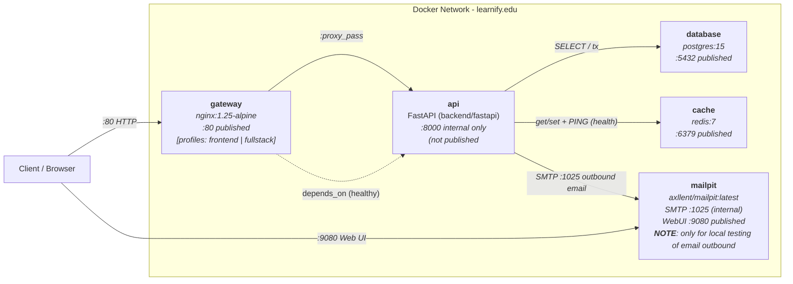

# Infrastructure (learnify.edu)

This directory packages the **four supporting Docker services** that back the Learnify.edu FastAPI application: an Nginx reverse-proxy gateway, a PostgreSQL 15 relational database, a Redis 7 key-value cache, and a Mailpit dev-SMTP + web-UI. All services (plus the FastAPI `api` service itself) are co-orchestrated from the project-root [`docker-compose.yml`](../docker-compose.yml).

> The FastAPI `api` service Dockerfile lives in [`backend/fastapi/Dockerfile`](../backend/fastapi/Dockerfile) — it is not part of the `infra/` directory, but it shares the compose network, depends on `database`, and is referenced below for context.

---

## 🏗️ Architecture Diagram



> **⚠️ Important profile gotcha:** A bare `docker compose up` (no `--profile`, no explicit service names) boots **api + database + cache + mailpit only** and skips the `gateway` service (gateway is gated behind profiles `frontend` / `fullstack`). The Makefile wrappers below **always include gateway**, however, because `backend/fastapi/Makefile` lists `gateway` explicitly in its `BACKEND_SERVICES` variable — naming a service directly bypasses its profile restriction.

---

## 📁 Directory Layout

```text
infra/
├── nginx/
│   ├── Dockerfile        # nginx:1.25-alpine image, strips default.conf, copies our nginx.conf
│   └── nginx.conf        # Virtual host, rate limit 10r/s, proxy_pass -> api:8000, fwd headers
├── postgres/
│   ├── Dockerfile        # postgres:15 image, injects init.sql below
│   └── init.sql          # Post-initialization hook (currently a stub; schema = Alembic)
├── redis/
│   └── Dockerfile        # redis:7 image (placeholder for future redis.conf injection)
└── mailpit/
    └── Dockerfile        # axllent/mailpit:latest image, documents SMTP 1025 + Web UI 8025, for local testing only
```

| File | Source | Purpose |
|---|---|---|
| [nginx/Dockerfile](./nginx/Dockerfile) | `FROM nginx:1.25-alpine` | Builds the `gateway` service image. Removes the default site and ships [nginx.conf](./nginx/nginx.conf). |
| [nginx/nginx.conf](./nginx/nginx.conf) | Mounted ro via compose | Virtual host on `:80`; `server_tokens off`; rate-limit zone `api_limit 10m 10r/s burst=5 nodelay`; returns **429** over quota; `proxy_pass http://api:8000` + forwards `Host`, `X-Real-IP`, `X-Forwarded-For`, `X-Forwarded-Proto`. |
| [postgres/Dockerfile](./postgres/Dockerfile) | `FROM postgres:15` | Builds the `database` service image. Copies [init.sql](./postgres/init.sql) into `/docker-entrypoint-initdb.d/` to run on first empty-volume startup. |
| [postgres/init.sql](./postgres/init.sql) | `docker-entrypoint-initdb.d` | Hook reserved for future extension. Today all schema creation is done by **Alembic** inside the `api` service startup (`alembic upgrade head`). |
| [redis/Dockerfile](./redis/Dockerfile) | `FROM redis:7` | Builds the `cache` service image. Contains commented-out template for mounting a custom `redis.conf` when needed. |
| [mailpit/Dockerfile](./mailpit/Dockerfile) | `FROM axllent/mailpit:latest` | Builds the `mailpit` service. Documents port usage: SMTP on `1025`, Web UI on `8025` inside the container. |

---

## 🧩 Services Matrix

Source of truth: [`docker-compose.yml`](../docker-compose.yml). Any discrepancy below → update this README in the same commit.

| Service | Image | Published Port (host) | Internal Port(s) | Healthcheck | Persistence | Compose Profile | Restart Policy |
|---|---|---|---|---|---|---|---|
| **gateway** | `nginx:1.25-alpine` | **80** → container 80 | n/a (listens on 80) | n/a; `depends_on api (healthy)` before it starts | none (config bind mount :ro) | **`frontend` \| `fullstack`** *(see note)* | `unless-stopped` |
| **api** | `python:3.12-slim` + project `Dockerfile` | _none (intra-compose only)_ | 8000 | `curl -f http://localhost:8000/api/v1/system/check-health` (validates Postgres `SELECT 1` + Redis `PING`) | none (bind mounts `backend/fastapi/app` + `.env :ro`) | always-on (no profile) | _not set_ |
| **database** | `postgres:15` | **5432** (or `${POSTGRES_PORT}`) → container 5432 | 5432 | `pg_isready -U ${POSTGRES_USER} -d ${POSTGRES_DB}` every 5s, `start_period 5s` | Named volume `database_data` → `/var/lib/postgresql/data` | always-on (no profile) | _not set_ |
| **cache** | `redis:7` | **6379** (or `${REDIS_PORT}`) → container 6379 | 6379 | `redis-cli ping` every 5s, `start_period 5s` | Named volume `cache_data` → `/data` | always-on (no profile) | _not set_ |
| **mailpit** | `axllent/mailpit:latest` | **9080** → container 8025 (Web UI) | SMTP **1025** (internal, not published) / Web UI 8025 | n/a | Named volume `mailpit_data` → `/data` (database file: `/data/mailpit.db`, `MP_MAX_MESSAGES=500`) | always-on (no profile) | `unless-stopped` |

> ***Note on gateway profile:** The raw compose profiles are `frontend` / `fullstack` — a bare `docker compose up` (no explicit service names) skips gateway. However, `make backend-fastapi-up` and all `backend/fastapi/Makefile` docker-* targets pass `gateway` as an explicit service name, which bypasses the profile restriction and always boots it. See [Lifecycle & Commands](#%EF%B8%8F-lifecycle--commands).*

> **Networking note:** Within the compose network, services reach each other by **service name as DNS hostname**. The API therefore connects to `database:5432`, `cache:6379`, and `mailpit:1025`. Only the API service ever talks to `database`, `cache`, and `mailpit` — the gateway never does.

---

## 💾 Volumes & Persistence

All stateful services use **Docker named volumes** (not bind mounts). They survive `docker compose down` but are destroyed with the `-v` flag.

| Volume Name | Container Mount Path | Owning Service | Purpose |
|---|---|---|---|
| `database_data` | `/var/lib/postgresql/data` | database | Postgres data directory (all tables, WAL, etc.) |
| `cache_data` | `/data` | cache | Redis RDB / AOF dumps (if persistence is later enabled via `redis.conf`) |
| `mailpit_data` | `/data` | mailpit | `mailpit.db` SQLite database + messages (`MP_DATABASE=/data/mailpit.db`) |

Wipe command (destroys all persisted state):

```bash
docker compose down -v --remove-orphans
# or via Makefile wrapper:  make backend-fastapi-down-v
```

---

## 🔐 Environment Variables

Seeds live in [`.env.local`](../.env.local). The `api` container reads `.env` from the project root via a read-only bind mount (see compose). The values that specifically concern the `infra/` services are:

| Variable | Default (from `.env.local`) | Used by | Why it matters |
|---|---|---|---|
| `POSTGRES_HOST` | `database` | api | Must match the database compose service-name (Docker DNS) |
| `POSTGRES_PORT` | `5432` | compose + api | Host publish port + internal connect port |
| `POSTGRES_USER` | `db_admin` | compose database + api | Role created at first init; used by `pg_isready` healthcheck |
| `POSTGRES_PASSWORD` | `db_password` | compose database + api | Role password |
| `POSTGRES_DB` | `db_name` | compose database + api | Initial DB name; Alembic runs against this |
| `REDIS_HOST` | `cache` | api | Must match the cache compose service-name (Docker DNS) |
| `REDIS_PORT` | `6379` | compose + api | Host publish port + internal connect port |
| `SMTP_HOST` | `mailpit` | api / email utils | SMTP host for outbound email delivery via Mailpit |
| `SMTP_PORT` | `1025` | api / email utils | Internal SMTP listener on Mailpit. Do NOT use 9080/8025 (those are the Web UI ports) |
| `EMAILS_FROM_EMAIL` | `noreply@email.app` | api / email utils | Envelope From of emails sent to Mailpit |

---

## 🧪 Healthchecks

| Healthcheck | Where it runs | What it validates |
|---|---|---|
| `api` — [`GET /api/v1/system/check-health`](../backend/fastapi/app/route.py#L17-L33) | Inside `api` container via curl | Postgres connection (`SELECT 1`) **and** Redis liveness (`PING`). Returns 503 + `{status: unhealthy}` if either is down. |
| `database` — `pg_isready` | Inside `database` container | Postgres server process is listening and accepting connections for `${POSTGRES_USER}` / `${POSTGRES_DB}` |
| `cache` — `redis-cli ping` | Inside `cache` container | Redis event loop is responding to commands |
| `gateway` | indirect | No explicit healthcheck — compose starts it only after `api` reports healthy (`depends_on condition: service_healthy`) |
| `mailpit` | none | No healthcheck today |

---

## 🌐 Network & Security Notes

- **Only two public listen ports** exist on the host by default: **80** (gateway/nginx, with profiles) and **5432** (Postgres), **6379** (Redis), **9080** (Mailpit Web UI).
- **API port 8000 is never published.** Traffic reaches it only through the nginx gateway or from tests exec'd into the compose network. Mailpit SMTP port 1025 is also internal only.
- **Rate limiting (gateway):** 10 requests/sec per client IP, burst queue of 5 with `nodelay`. Excess traffic returns **HTTP 429 Too Many Requests** (configured explicitly via `limit_req_status 429` instead of nginx's default 503).
- **Version token suppression:** `server_tokens off` hides the exact Nginx/OS version from error pages and response headers.
- **Restart resilience:** Only `gateway` and `mailpit` currently carry `restart: unless-stopped`. `api`, `database`, and `cache` do **not** auto-restart on crash — raise this as a deliberate change if you want them to.

---

## ▶️ Lifecycle & Commands

All wrappers live in the project-root [`Makefile`](../Makefile). Raw `docker compose` equivalents are listed next to each.

### Backend + Gateway wrappers (Makefile always includes gateway)

The Makefile target `backend-fastapi-up` delegates to [`backend/fastapi/Makefile`](../backend/fastapi/Makefile), which hardcodes `BACKEND_SERVICES := gateway api database cache mailpit` and passes those service names directly to Compose. Naming a service explicitly overrides its profile restriction, so **gateway always starts under these wrappers** even though its declared profiles are `frontend | fullstack`.

```bash
make backend-fastapi-up
# Equivalent: (cd backend/fastapi && make docker-up)
#          → docker compose --profile backend up -d gateway api database cache mailpit
#            (gateway is pulled in via explicit service name, not profile)

make backend-fastapi-restart    # stop/rm + re-up all 5 BACKEND_SERVICES
make backend-fastapi-down       # stop + rm containers, keep volumes
make backend-fastapi-down-v     # stop + rm + DELETE ALL volumes (db/cache/mailpit data gone!)
make backend-fastapi-build      # docker compose build --no-cache on all BACKEND_SERVICES
```

### Fullstack (backend stack + native Nuxt dev server)

```bash
make fullstack-up
# → runs `make backend-fastapi-up` (all 5 services, incl. gateway), THEN launches
#   the native Nuxt 4 dev workspace via `make frontend-nuxt-dev`

make fullstack-down
# → runs `make backend-fastapi-down` only; Nuxt dev server is a host process (ctrl-c to quit)
```

### Raw `docker compose` equivalents (by profile / explicit service name)

```bash
# — Gateway WILL start here ————————————————————————————————————————————————————
docker compose --profile fullstack up -d --build   # profile fullstack → gateway eligible
docker compose --profile frontend  up -d --build   # profile frontend  → gateway eligible
docker compose                     up -d --build gateway api database cache mailpit
                                                   # explicit names → profile bypassed

# — Gateway will NOT start here (you get api+db+cache+mailpit ONLY) ————————————
docker compose                     up -d --build   # no profile, no explicit service names
```

### Direct inspection

```bash
# List services, port mappings, health status
docker compose ps

# Stream a service's logs
docker compose logs -f api
docker compose logs -f gateway
docker compose logs -f database

# Open Mailpit Web UI (after boot)
#   browser → http://localhost:9080

# Verify gateway proxies correctly (gateway must be running for :80 to respond)
curl -i http://localhost/api/v1/system/check-health
```

---

## 🐞 Troubleshooting

| Symptom | Likely Cause | Check |
|---|---|---|
| `curl http://localhost/...` → **connection refused** on :80 | `gateway` service is not running (profile wasn't enabled) | `docker compose ps` → is `gateway` present? If not, use `--profile fullstack` or `make fullstack-up`. |
| Gateway returns **502 Bad Gateway** immediately after `up` | `api` service is still starting / hasn't passed its healthcheck yet (gateway waits on `condition: service_healthy`) | Wait for `docker compose ps` to show api = `healthy`. Check `docker compose logs api` for Alembic errors or DB connection failures. |
| Health endpoint returns **503 unhealthy** with `status: unhealthy` and `error` key set | Either Postgres or Redis failed the API's internal liveness probe | `docker compose logs database` and `docker compose logs cache`; verify env vars hostnames `database`/`cache` are not overridden to `localhost` inside the api container |
| Emails "sent" but nothing shows up at `http://localhost:9080` | Wrong SMTP port used in sender code, or sender points to the Mailpit Web UI port | API must connect to **`mailpit:1025`** (internal SMTP). Web UI is port 8025/9080 and never receives SMTP. Verify `SMTP_HOST=mailpit`, `SMTP_PORT=1025` in env. |
| Postgres `FATAL: password authentication failed` after env change | Old `database_data` volume was initialized with different creds on first empty-volume boot. Postgres never re-runs init scripts on an existing volume. | Run `make backend-fastapi-down-v` (destroys volume) then re-up. |

---

## 🏷️ Image Pins (Upgrade Checklist)

| Service | Current Tag | Dockerfile |
|---|---|---|
| gateway | `nginx:1.25-alpine` | [nginx/Dockerfile](./nginx/Dockerfile) |
| database | `postgres:15` | [postgres/Dockerfile](./postgres/Dockerfile) |
| cache | `redis:7` | [redis/Dockerfile](./redis/Dockerfile) |
| mailpit | `axllent/mailpit:latest` | [mailpit/Dockerfile](./mailpit/Dockerfile) |
| api (not in infra/) | `python:3.12-slim` | [backend/fastapi/Dockerfile](../backend/fastapi/Dockerfile) |

> ⚠️ `mailpit:latest` is the only unpinned tag today. Consider pinning to a specific release when you ship to staging/prod to avoid surprise upgrades.

---

## ✅ Drift Guard

The **single source of truth** for every port, image tag, volume mapping, healthcheck, env var, and profile in this README is the project-root [`docker-compose.yml`](../docker-compose.yml) plus the individual `infra/*/Dockerfile` files. If you touch any of those, update this README **in the same commit**.
